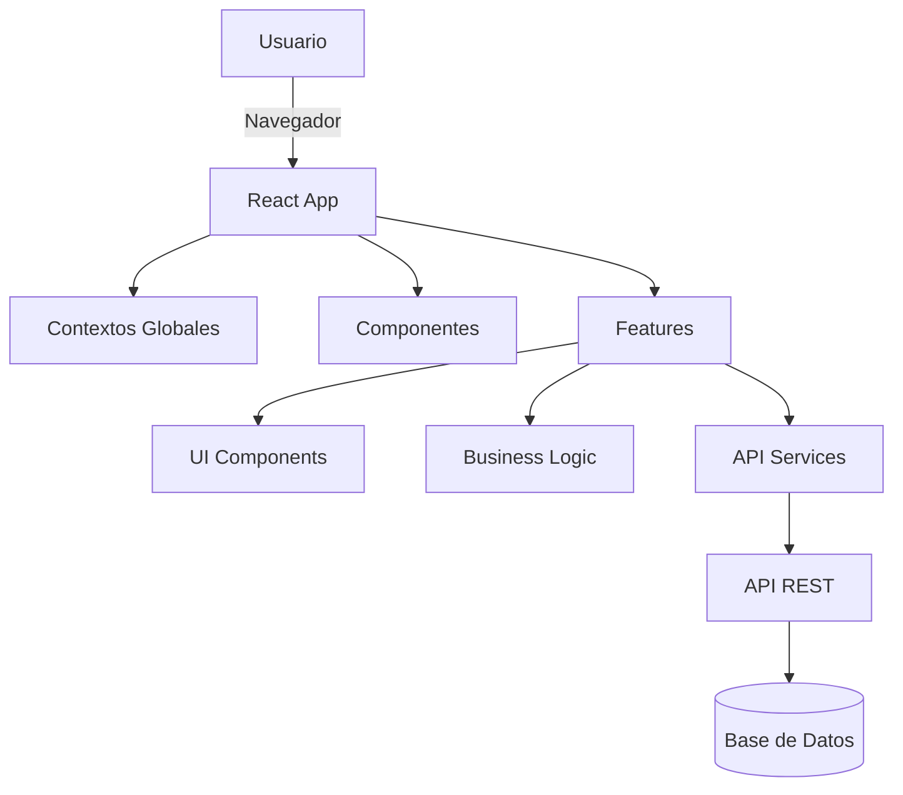

<div align="center">
  
  <br/>
  <br/>
  
  
  
  
  
  
  
  

</div>
<br/>

# ReflexoPeru-V2-Front

Bienvenido al frontend de **ReflexoPeru**, una plataforma moderna y completa para la gestión integral de clínicas de reflexología. Este proyecto está desarrollado con React + Vite y sigue una arquitectura modular, escalable y profesional.

## 📋 Descripción General

ReflexoPeru-V2-Front permite administrar pacientes, historiales médicos, citas, calendario, reportes, personal (terapeutas) y configuraciones del sistema. Facilita la operación diaria mediante una interfaz intuitiva y proporciona herramientas para la toma de decisiones con reportes y métricas visuales.

### Características Principales

✅ **Gestión de Pacientes**
- Registro y edición completa de pacientes
- Búsqueda avanzada por DNI, nombre o apellidos
- Historial médico detallado
- Información de métodos anticonceptivos (para pacientes femeninas)
- Seguimiento de peso, altura y medidas

✅ **Gestión de Citas**
- Registro y programación de citas
- Edición y actualización de estado
- Vista de citas completadas
- Asignación de terapeutas
- Gestión de pagos

✅ **Calendario Interactivo**
- Vista mensual, semanal y diaria
- Drag & drop de citas
- Filtros por terapeuta
- Mini calendario para navegación rápida

✅ **Reportes y PDFs**
- Reporte diario de caja
- Reporte de terapeutas
- Reporte de pacientes por terapeuta
- Generación de fichas médicas en PDF
- Tickets/boletas para pacientes

✅ **Dashboard y Estadísticas**
- Métricas en tiempo real
- Gráficos interactivos con ApexCharts
- KPIs principales
- Resumen de actividades

✅ **Sistema de Temas**
- Modo claro y oscuro
- Persistencia de preferencias
- Variables CSS dinámicas

✅ **Gestión de Personal**
- CRUD de terapeutas
- Búsqueda y filtrado
- Información de contacto y ubicación

✅ **Configuración**
- Perfil de usuario
- Gestión de usuarios del sistema
- Métodos de pago y precios
- Métodos anticonceptivos y tipos de DIU
- Configuración del sistema

## 🚀 Tecnologías Principales

### Core
- **React 19.1.0** - Librería de UI con las últimas características
- **Vite 6.3.5** - Build tool ultrarrápido y dev server
- **React Router 7.6.2** - Enrutamiento y navegación

### UI y Componentes
- **Ant Design 5.x** - Sistema de componentes profesional
- **ApexCharts 4.7.0** - Visualización de datos y gráficos
- **Tremor React** - Componentes adicionales para dashboards
- **Framer Motion** - Animaciones fluidas
- **Phosphor Icons** - Iconografía moderna

### Utilidades
- **Axios 1.9.0** - Cliente HTTP con interceptores
- **Day.js** - Manejo de fechas (más ligero que Moment.js)
- **React PDF Renderer** - Generación de PDFs
- **React Big Calendar** - Componente de calendario completo
- **ExcelJS** - Exportación a Excel

### Calidad de Código
- **Biome** - Linter y formateador ultrarrápido
- **Stylelint** - Linter para CSS/SCSS
- **TypeScript** - Tipado en componentes críticos

## 📁 Estructura del Proyecto

```
src/
├── assets/                 # Recursos estáticos (fuentes, imágenes)
├── components/            # Componentes reutilizables
│   ├── Button/           # Botones personalizados
│   ├── charts/           # Gráficos (TypeScript)
│   ├── Form/             # Formularios
│   ├── Input/            # Campos de entrada
│   ├── Loading/          # Spinners y loaders
│   ├── Modal/            # Modales universales
│   ├── PdfTemplates/     # Plantillas para PDFs
│   ├── Select/           # Selectores con caché
│   ├── Table/            # Tablas y paginación
│   └── ...
├── constants/            # Constantes TypeScript
├── context/              # Contextos globales (Theme, User, Company, Toast)
├── css/                  # Estilos globales
│   ├── Animations.css
│   ├── normalize.css
│   ├── Typography.css
│   └── VarColors.css
├── features/             # Módulos funcionales
│   ├── appointments/     # Gestión de citas
│   ├── appointmentsComplete/
│   ├── auth/             # Autenticación
│   ├── calendar/         # Calendario
│   ├── configuration/    # Configuraciones
│   │   ├── cContraceptive/
│   │   ├── cPayments/
│   │   ├── cProfile/
│   │   ├── cSystem/
│   │   └── cUsers/
│   ├── history/          # Historial de pacientes
│   ├── home/             # Página principal
│   ├── patients/         # Gestión de pacientes
│   ├── reports/          # Reportes
│   ├── staff/            # Gestión de personal
│   └── statistic/        # Estadísticas y dashboard
├── hooks/                # Hooks personalizados globales
├── lib/                  # Librerías compartidas (TypeScript)
├── pages/                # Páginas principales
├── routes/               # Rutas y protección
├── services/             # Servicios de API y notificaciones
│   ├── api/
│   └── toastify/
└── utils/                # Utilidades (formatters, config, etc.)
```

Cada **feature** sigue la estructura:
```
feature/
├── ui/           # Componentes visuales
├── hook/         # Lógica de negocio (hooks)
└── service/      # Llamadas a API
```

## 🏗️ Arquitectura



### Patrones de Diseño
- **Feature-Sliced Design**: Organización modular por funcionalidad
- **Context Pattern**: Estado global (Theme, User, Toast, Company)
- **Custom Hooks**: Lógica reutilizable separada de UI
- **Service Layer**: Abstracción de llamadas a API
- **CSS Modules**: Estilos con scope local

## 🛠️ Instalación y Configuración

### Prerrequisitos
- Node.js 18+ 
- npm o yarn

### Instalación

```bash
# Clonar el repositorio
git clone <url-del-repositorio>

# Entrar al directorio
cd ReflexoPeru-V2-Front

# Instalar dependencias
npm install
```

### Configuración

1. Configurar la URL de la API en `src/utils/vars.js` o `src/services/api/Axios/baseConfig.js`

2. Variables de entorno (opcional):
```env
VITE_API_URL=https://api.reflexoperu.com
```

### Ejecutar en Desarrollo

```bash
npm run dev
```

La aplicación estará disponible en `http://localhost:5173`

### Compilar para Producción

```bash
npm run build
```

Los archivos compilados estarán en la carpeta `dist/`

### Otros Scripts

```bash
# Linter (Biome)
npm run lint

# Linter de estilos (Stylelint)
npm run stylelint

# Vista previa de la build
npm run preview
```

## 📚 Documentación

La documentación completa está organizada en la carpeta `/docs`:

| Documento | Descripción |
|-----------|-------------|
| [Arquitectura](./docs/arquitectura.md) | Diagrama y explicación del flujo general |
| [Componentes](./docs/components.md) | Componentes reutilizables y su uso |
| [Hooks](./docs/hooks.md) | Hooks personalizados y ejemplos |
| [Servicios](./docs/services.md) | Servicios de API, notificaciones y utilidades |
| [Rutas](./docs/routes.md) | Navegación y protección de vistas |
| [Estilos](./docs/styles.md) | Organización y buenas prácticas de CSS |
| [Features](./docs/features.md) | Funcionalidades detalladas de cada módulo |
| [FAQ](./docs/faq.md) | Preguntas frecuentes y solución de problemas |
| [Optimizaciones Staff](./docs/optimizaciones-staff.md) | Sistema de caché y mejoras de rendimiento |

## 🎨 Sistema de Temas

La aplicación soporta modo claro y oscuro mediante `ThemeContext`:

```javascript
import { useTheme } from './context/ThemeContext';

const MyComponent = () => {
  const { theme, toggleTheme } = useTheme();
  // theme: 'light' | 'dark'
};
```

Las variables CSS se adaptan automáticamente según el tema seleccionado.

## 🔒 Autenticación

El sistema de autenticación está implementado con:
- Token JWT almacenado en localStorage
- Rutas protegidas con `ProtectedRoute`
- Contexto de autenticación (`AuthContext`)
- Interceptores de Axios para incluir token en requests

## 🚀 Optimizaciones Implementadas

### Sistema de Caché
- **Ubicación**: `src/components/Select/SelectsApi.js`
- Cachea respuestas de APIs frecuentemente usadas
- Reduce significativamente las llamadas al backend
- Función `clearApiCache()` para limpiar cuando sea necesario

### Precarga de Datos
- Los modales precargan sus datos antes de abrirse
- Mejora la velocidad percibida por el usuario
- Implementado especialmente en edición de staff y pacientes

### Memoización
- `useMemo` para cálculos costosos
- `useCallback` para funciones que se pasan como props
- `React.memo` en componentes que se renderizan frecuentemente

### Code Splitting
- Lazy loading de rutas (preparado para implementar)
- Chunks optimizados por Vite

### Debouncing
- Búsquedas con delay de 1 segundo
- Reduce peticiones innecesarias al backend

### Paginación
- Todas las listas implementan paginación
- Carga incremental de datos

## 📄 Generación de PDFs

La aplicación genera varios tipos de PDFs:
- **Fichas médicas**: Historial completo del paciente
- **Tickets/Boletas**: Para pagos y consultas
- **Reportes de caja**: Resumen diario de ingresos
- **Reportes de terapeutas**: Actividad por terapeuta
- **Reportes de pacientes**: Listado por terapeuta

Todos los PDFs se generan usando `@react-pdf/renderer` con plantillas personalizadas en `src/components/PdfTemplates/`.

## 🧪 Testing

(Por implementar)
- Tests unitarios con Vitest
- Tests de integración
- Tests E2E con Playwright

## 🤝 Contribución

Para contribuir al proyecto:

1. Fork el repositorio
2. Crea una rama para tu feature (`git checkout -b feature/nueva-funcionalidad`)
3. Commit tus cambios (`git commit -m 'Agrega nueva funcionalidad'`)
4. Push a la rama (`git push origin feature/nueva-funcionalidad`)
5. Abre un Pull Request

### Convenciones de Código

- **JavaScript**: Seguir las reglas de Biome
- **CSS**: Seguir las reglas de Stylelint
- **Commits**: Mensajes descriptivos y en español
- **Componentes**: Un componente por archivo
- **Nombres**: camelCase para variables, PascalCase para componentes

## 📝 Notas Importantes

- El proyecto usa **React 19.1.0** con las últimas características
- Algunos componentes usan **TypeScript** (gráficos, utilidades)
- El sistema de caché mejora significativamente el rendimiento
- Los selectores de ubicación (Ubigeo) están optimizados con caché
- Se recomienda usar el modo oscuro para mejor experiencia visual

## 🐛 Solución de Problemas

### localStorage corrupto
Si experimentas problemas con el tema o datos guardados:

```javascript
// Ejecutar en consola del navegador
localStorage.clear();
location.reload();
```

O usar el script de limpieza incluido: `clean-localStorage.js`

### Problemas con la API
Verificar la configuración de la URL base en:
- `src/utils/vars.js`
- `src/services/api/Axios/baseConfig.js`

### Errores de autenticación
Si el token expira, la aplicación redirige automáticamente al login. Verificar:
- Token almacenado en localStorage
- Interceptores de Axios funcionando correctamente


