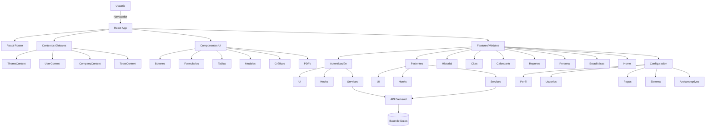

# Arquitectura

La arquitectura de ReflexoPeru-V2-Front está basada en una estructura modular, escalable y desacoplada, facilitando el mantenimiento y la evolución del proyecto.

## Diagrama de Arquitectura



## Estructura del Proyecto

### 1. Capa de Presentación (UI)
**Ubicación**: `src/components/` y `src/features/*/ui/`

- **Componentes Reutilizables**: Elementos de UI que se usan en múltiples lugares
- **Componentes de Feature**: UI específica de cada módulo funcional
- **Páginas**: Vistas principales que combinan múltiples componentes

### 2. Capa de Lógica (Hooks)
**Ubicación**: `src/hooks/` y `src/features/*/hook/`

- **Hooks Globales**: Lógica compartida entre módulos
- **Hooks de Feature**: Lógica específica de cada módulo
- **Custom Hooks**: Encapsulan lógica reutilizable y estado

### 3. Capa de Servicios
**Ubicación**: `src/services/` y `src/features/*/service/`

- **Servicios de API**: Comunicación con el backend
- **Servicios de Utilidad**: Funciones helper y formateo
- **Configuración**: Setup de librerías externas (Axios, Day.js, etc.)

### 4. Capa de Estado Global (Context)
**Ubicación**: `src/context/`

- **ThemeContext**: Gestión del tema (claro/oscuro)
- **UserContext**: Estado del usuario autenticado
- **CompanyContext**: Información de la empresa
- **ToastContext**: Sistema de notificaciones global

### 5. Rutas y Navegación
**Ubicación**: `src/routes/`

- **Router.jsx**: Definición de todas las rutas
- **ProtectedRoute.jsx**: Rutas protegidas por autenticación
- **AuthContext.jsx**: Contexto de autenticación

## Flujo de Datos

### Flujo Normal (Lectura)
```
Usuario → Componente UI → Hook → Service → API → Backend
                ↓
            Estado Local
                ↓
          Renderizado UI
```

### Flujo de Escritura
```
Usuario → Acción UI → Hook → Service → API → Backend
                                         ↓
                                    Actualización
                                         ↓
                                    Refetch Data
                                         ↓
                                    Actualizar UI
```

### Flujo con Context
```
App Initialization → Context Provider → Estado Global
                           ↓
                    Componentes Hijos
                           ↓
                    useContext Hook
                           ↓
                    Acceso al Estado
```

## Principios de Arquitectura

### 1. Separación de Responsabilidades
- **UI**: Solo presentación y eventos de usuario
- **Hooks**: Lógica de negocio y gestión de estado
- **Services**: Comunicación con APIs externas
- **Utils**: Funciones puras y helpers

### 2. Modularidad
Cada feature es independiente y contiene:
```
feature/
├── ui/           # Componentes visuales
├── hook/         # Lógica del feature
└── service/      # Llamadas a API
```

### 3. Reutilización
- Componentes genéricos en `src/components/`
- Hooks compartidos en `src/hooks/`
- Utilidades en `src/utils/`

### 4. Escalabilidad
- Fácil agregar nuevos features
- Componentes independientes
- Estado local vs global bien definido

### 5. Mantenibilidad
- Código organizado por funcionalidad
- Patrones consistentes
- TypeScript en componentes críticos (gráficos, utils)

## Patrones de Diseño Utilizados

### 1. Feature-Sliced Design
Cada feature contiene todo lo necesario para funcionar:
- UI Components
- Business Logic (Hooks)
- Data Services
- Types/Interfaces (cuando aplica)

### 2. Context Pattern
Para estado global que necesitan múltiples componentes:
- Theme (tema de la aplicación)
- User (usuario autenticado)
- Toast (notificaciones)
- Company (información de la empresa)

### 3. Custom Hooks Pattern
Encapsular lógica reutilizable:
- Fetching de datos
- Gestión de formularios
- Paginación
- Búsqueda con debounce

### 4. Service Layer Pattern
Abstraer las llamadas a API:
- Centralizan la lógica de comunicación
- Facilitan el testing
- Permiten cambiar la implementación sin afectar componentes

### 5. Render Props & Composition
Componentes flexibles y reutilizables:
- Modales universales
- Tablas configurables
- Formularios genéricos

## Optimizaciones Implementadas

### 1. Sistema de Caché
**Ubicación**: `src/components/Select/SelectsApi.js`
- Cachea respuestas de APIs frecuentemente usadas
- Reduce llamadas al backend
- Mejora el rendimiento general

### 2. Code Splitting
- Lazy loading de rutas
- Importaciones dinámicas
- Chunks optimizados por Vite

### 3. Memoización
- `useMemo` para cálculos costosos
- `useCallback` para funciones que se pasan como props
- React.memo en componentes que se renderizan frecuentemente

### 4. Debouncing
- Búsquedas con retraso para reducir peticiones
- Implementado en campos de búsqueda

### 5. Paginación
- Datos cargados por páginas
- Reduce la carga inicial
- Mejora la experiencia de usuario

## Stack Tecnológico

### Core
- **React 19.1.0**: Librería de UI
- **Vite 6.3.5**: Build tool y dev server
- **React Router 7.6.2**: Enrutamiento

### UI
- **Ant Design 5.x**: Sistema de componentes
- **CSS Modules**: Estilos con scope local
- **ApexCharts 4.7.0**: Visualización de datos

### Utilidades
- **Axios 1.9.0**: Cliente HTTP
- **Day.js**: Manejo de fechas
- **React PDF**: Generación de PDFs

### TypeScript
- Componentes de gráficos
- Utilidades de charts
- Constantes y configuraciones

## Buenas Prácticas

1. **Un componente, una responsabilidad**
2. **Hooks para lógica, componentes para UI**
3. **Services para toda comunicación con API**
4. **Context solo para estado verdaderamente global**
5. **TypeScript en código crítico y compartido**
6. **CSS Modules para evitar conflictos de estilos**
7. **Código limpio sin comentarios innecesarios**
8. **Nombres descriptivos y consistentes**

## Futuras Mejoras

- Implementar más TypeScript en toda la aplicación
- Tests unitarios e integración
- Documentación automática con TypeDoc
- CI/CD para despliegue automatizado
- PWA para acceso offline
